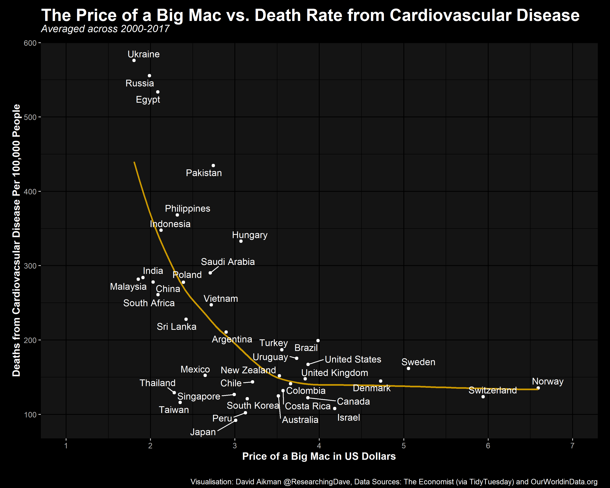

# Burger Prices and Deaths from Cardiovascular Disease
Burger data is [here](https://github.com/rfordatascience/tidytuesday/tree/master/data/2020/2020-12-22), death data is [here](https://ourworldindata.org/grapher/cardiovascular-disease-death-rates?tab=chart).

Here is what I did with the data. The code in 'script.R' and the .csv file should reproduce these figures.
 

